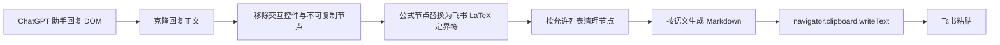

# ChatGPT 飞书富文本复制：业务与开发原则

本文档集中定义插件长期保持稳定的业务行为、数据结构和开发边界。新增交互、转换规则或页面适配时，应先检查是否符合这些原则，再增量补充本文档。

## 用户可见行为

插件只在每条 ChatGPT 助手回复的原生操作栏中增加一个“复制飞书文档版”图标按钮。按钮默认保持低对比度，悬停和键盘聚焦时提高可见度。提示气泡挂在页面顶层并显示在按钮下方，避免被操作栏裁切；点击成功后显示“已复制飞书文档版, 去粘贴吧~”。

ChatGPT 自带的复制按钮、文本选区复制、代码块复制和浏览器剪贴板接口必须保持原样。插件不得重写 `navigator.clipboard`，不得拦截页面的 `copy` 事件，也不得阻止原生按钮的点击事件。

一次点击只复制按钮所属的那条助手回复。找不到明确的助手回复正文或剪贴板写入失败时，插件应显示失败状态并记录可诊断错误，禁止用不完整内容伪装成功。

## 复制内容

剪贴板只写入 `text/plain` Markdown。2026 年 8 月 6 日的真实飞书验收确认 Markdown 整体基本可解析；同内容的 `text/html` 会被飞书当作普通文字显示标签，因此生产路径禁止携带 HTML 格式。

| 内容 | Markdown 输出 |
|---|---|
| 标题 | `#` 至 `######` |
| 段落与换行 | 空行与换行 |
| 强调与删除 | `**`、`*`、`***`、`~~`；对应粗体、斜体、粗斜体与删除线 |
| 列表与引用 | Markdown 列表与 `>` |
| 代码 | 反引号与围栏代码块 |
| 表格 | Markdown 管道表格 |
| 超链接 | `[文字](地址)`，真实插件测试已识别为可点击链接 |
| 行内公式 | `$LaTeX$` |
| 独立公式 | 独立的 `$$` 块，当前飞书未自动居中 |

公式原文优先读取 KaTeX 或 MathJax 的 TeX 注释，其次读取节点明确提供的 LaTeX 属性。无法可靠得到原公式时应保留页面可见文字，禁止根据渲染结果猜测公式。

独立公式的开始定界符、LaTeX 内容和结束定界符在 Markdown 中使用换行分隔。真实验收确认飞书能识别公式但不会自动居中；飞书原生居中公式的 `text/plain` 仍只有 `$$formula$$`，居中信息只存在于包含页面、记录、块和作者标识的未公开 HTML 内部结构中。本版保留靠左公式，需要时由用户在飞书中手动居中；插件不得伪造飞书内部记录，也不得用固定空格或固定 LaTeX 间距伪造居中。

## 数据流

转换器只处理传入的回复副本，不修改 ChatGPT 正文。内容脚本负责发现回复操作栏、注入按钮、调用转换器和写入剪贴板。CSS 只作用于带 `data-feishu-copy-*` 标记的插件节点，避免污染页面样式。

## 页面适配边界

按钮必须锚定在已确认属于助手回复的原生回复复制按钮旁边。页面结构变化导致无法同时确认助手正文和原生操作栏时，本轮不注入按钮，并等待后续页面变化重新检查。

页面使用动态渲染，因此通过 `MutationObserver` 监听新增内容，并合并同一轮变化中的重复扫描。每个原生复制按钮最多对应一个插件按钮，重复执行初始化不得产生重复按钮。

## 安全与隐私

插件只在 `chatgpt.com` 和 `chat.openai.com` 本地运行，不发送聊天内容，不加载远程代码，不记录分析数据，不申请与核心复制功能无关的权限。

转换前使用允许列表保留语义节点，只读取链接地址、表格跨行跨列和有序列表起始值等必要属性。脚本、样式、表单、媒体和页面交互元素不进入 Markdown；链接只允许 `http`、`https`、`mailto` 和页面内锚点。

## 开源来源

项目参考 MIT 协议项目 `BigCatNotFat/chatgpt-feishu-formula-copy` 的公式提取思路、运行域名和基础构建方式。当前项目重新设计了交互边界与内容转换：独立按钮不会介入原生复制流程，剪贴板使用结构化 Markdown 输出，并覆盖标题、列表、引用、代码、表格和链接地址。

上游 MIT 许可证声明保留在 `LICENSE` 和 `NOTICE.md` 中。后续复用上游的实质代码或素材时，必须继续保留对应版权声明。

## 飞书兼容性基线

2026 年 8 月 6 日的真实 ChatGPT 到飞书测试与验收样本确认：一级至五级标题、行内与独立公式、表格、超链接、基础粗体、基础斜体、下划线和删除线均可识别。独立公式保持靠左，需要用户手动居中。粗斜体组合与行内代码在不同飞书样本中的识别结果不一致，0.1.0 保留现有 Markdown 输出并记录为已知限制，后续根据专项最小测试调整。转换器继续用相邻及嵌套组合测试防止这些 Markdown 标记在代码层面丢失。
