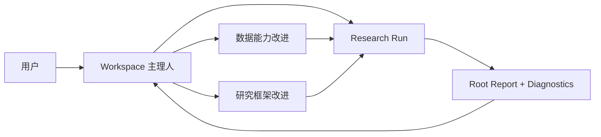
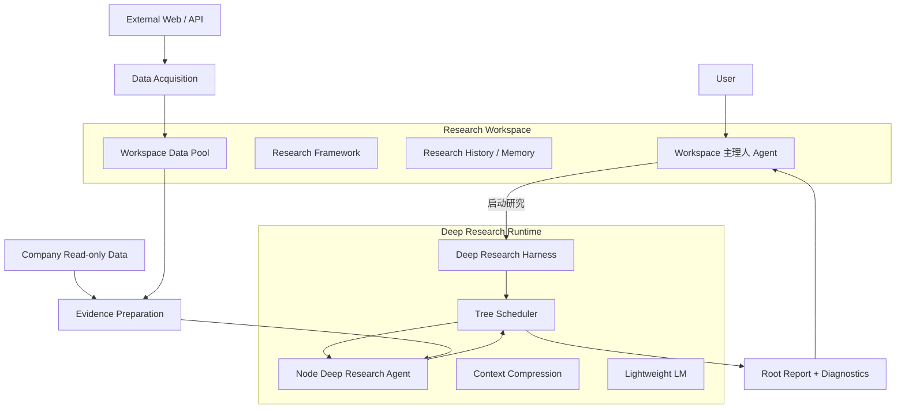
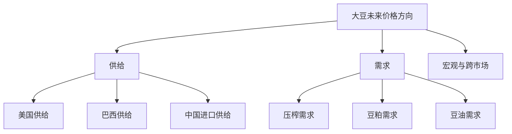
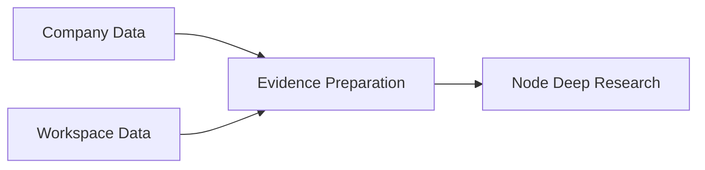
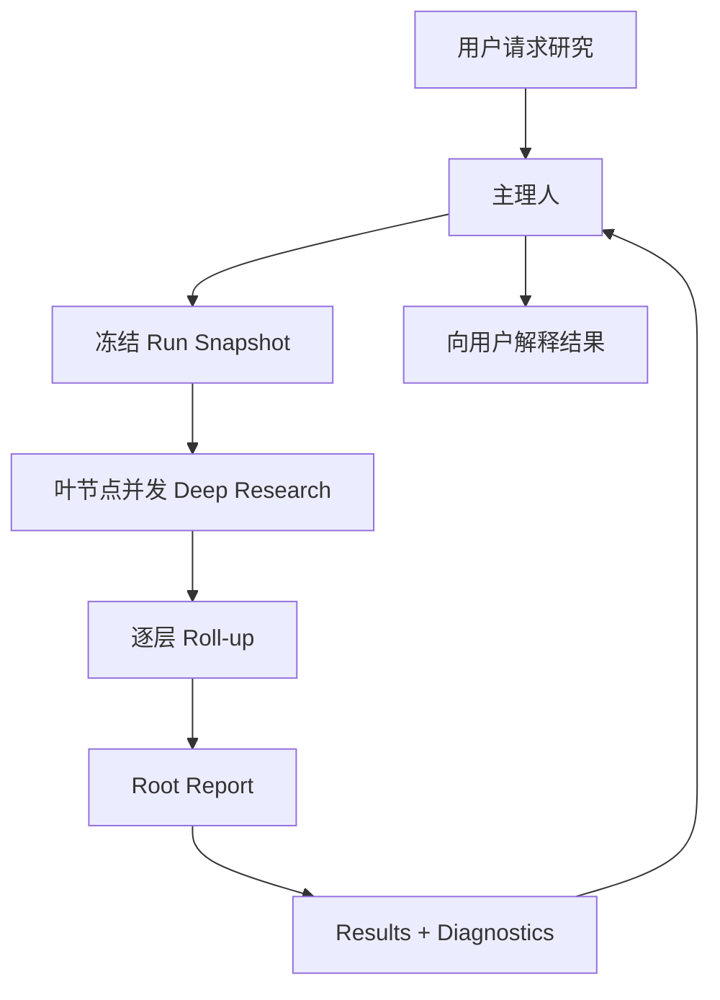

对，前一版的问题主要在于：**过早进入组件说明，导致读者先看到很多局部设计，再自己拼出系统全貌。** 对我们这种架构文档，更合适的顺序应该是先回答四个问题：这个项目到底是什么、为什么需要它、它整体怎么工作、各部分分别负责什么。之后再讨论数据、Skill、演化和 PIT 这些具体机制。

我重新把结构收了一遍。一级标题建议只保留四个：

1. **项目概述**：定义项目、目标、核心工作循环和设计原则。
2. **系统架构与职责边界**：解释 Workspace、两类 Agent、Harness、Research Framework、数据和 Skill 分别是什么。
3. **运行与演化机制**：从用户发起研究开始，讲一次 Run 怎么执行，以及 Run 结束后怎么演化数据和 Framework。
4. **关键约束与 Prototype 边界**：把 PIT、状态冻结、自我验证、外部数据维护成本、Sub-agent 等必须守住的问题集中说明。

下面是按这个逻辑重写的一版。

---

# Self-Evolving Research Workspace

## 架构、职责边界与运行机制

## 1. 项目概述

### 1.1 项目要解决什么问题

本项目希望建立一种可以**长期运行、周期性更新并持续改进自身研究方法**的金融研究系统。

以中国大豆研究为例，系统首先拥有一套结构化的研究框架，将“未来大豆价格如何变化”这一最终问题逐层拆解成供给、需求、宏观环境、区域生产、库存、贸易等更小的研究问题。每隔一周或一个月，系统可以在指定的 point-in-time 上重新执行整套研究，更新所有局部判断，并最终形成根节点的完整报告。

但系统的目标并不止于重复执行同一套研究。

随着研究持续进行，Agent 还应该逐渐发现：

* 原有研究框架是否遗漏了重要问题；
* 某些节点是否拆分得不合理；
* 某些研究问题是否长期缺少关键证据；
* 是否存在值得长期建设的新数据源；
* 某些已有数据或研究方法是否已经没有价值。

因此，本项目实际上包含两个不同时间尺度的循环：

[
\text{周期性研究}
\rightarrow
\text{更新当前市场判断}
]

以及：

[
\text{长期观察研究过程}
\rightarrow
\text{改进数据能力与研究框架}
]

前者解决“**现在市场是什么状态**”，后者解决“**我们应该怎样研究这个市场**”。

现有系统已经验证了其中一部分基本机制：研究可以组织成带稳定节点 ID 的树，用户通过 Workspace 主理人 Agent 启动 Deep Research，节点结果按照依赖关系逐层汇总；一次运行也可以冻结框架、时间和相关执行状态。

### 1.2 核心产品形态

整个产品围绕一个长期存在的 **Research Workspace** 展开。

用户并不直接操作大量 Deep Research Agent，也不直接管理数据脚本和运行调度。用户面对的是 Workspace 中的主理人 Agent。

一个典型的用户体验是：

> “帮我更新一下本周的大豆研究。”

主理人读取当前研究框架，启动完整 Deep Research Workflow。系统从靠近叶子的研究节点开始执行，逐层汇总，最终得到根节点报告。

之后用户可能继续问：

> “为什么这一次对巴西供给这么不确定？”

或者：

> “这个框架是不是没有考虑中国进口到港？”

主理人可以查看节点结果、研究过程和已有数据。如果只是一次性的研究问题，可以重新运行局部节点；如果发现长期的数据缺口，可以建设新的数据能力；如果问题来自框架结构，则可以修改 Research Framework。

因此系统的长期循环可以概括为：

我们真正想验证的是：

> **一个强 Agent 是否能够长期管理一项研究，在持续执行研究的过程中逐渐建设自己的数据能力，并改善自己的研究范式。**

### 1.3 设计上的基本取舍

Prototype 阶段不追求把这套能力深度嵌入现有数据平台。

公司已有数据库作为外部只读数据源继续存在；新的外部数据由当前 Workspace 自己管理。Research Harness 也保持相对独立。

这样可以先验证最关键的闭环：

[
Research
\rightarrow
Diagnostics
\rightarrow
Improvement
\rightarrow
Research
]

等这一范式真正跑通以后，再决定哪些能力应该沉入正式平台。

这也延续了原有方案中“私有框架和实验资产先在 Workspace 内迭代，成熟后再考虑进入正式平台”的思路。

---

# 2. 系统架构与职责边界

整个系统可以划分成五个核心部分：

## 2.1 Workspace 与主理人 Agent

Workspace 是系统中唯一真正长期存在的研究主体。

它保存研究框架、Workspace 自己建设的数据、历史研究结果以及长期研究经验。原有系统已经把 Workspace 定义成可以容纳框架、脚本、本地数据和运行产物的私有研究空间。

Workspace 主理人 Agent 是这套长期状态的管理者，也是用户主要交互的对象。

它负责：

* 理解用户当前的研究需求；
* 阅读和理解 Research Framework；
* 启动完整或局部 Research Run；
* 查看 Root Report 和各节点 Diagnostics；
* 判断问题来自短期证据、长期数据缺口还是 Framework 本身；
* 建设或修改 Workspace 的数据能力；
* 修改 Research Framework；
* 验证修改以后研究是否真正改善。

主理人拥有比较高的 Workspace 权限，但它的核心职责应当是**研究管理和系统演化决策**，而不是长期亲自承担大量低层代码工作。

第一阶段可以允许它直接写简单 SQL 或小型处理脚本。随着系统复杂度增加，可以逐渐加入 Coding Sub-agent，由主理人定义任务、检查结果和决定是否采用，Coding Sub-agent 负责 crawler、数据处理和其他工程实现。

这样可以控制 Agent 数量，又为后期扩展留出空间。

## 2.2 Node Deep Research Agent 与 Harness

Node Deep Research Agent 是短生命周期的局部研究者。

一次调用只回答一个明确的研究问题：

[
Node\ Question
+
Evidence
+
Child\ Results
\rightarrow
Node\ Conclusion
]

它可以联网搜索、阅读研报、分析公司数据和处理矛盾。

同时，它还应该报告研究过程中暴露的问题，例如证据不足、潜在数据缺口、scope 不合理或者新出现的重要变量。

因此 Node Deep Research 的结果可以理解成：

[
Research\ Result + Diagnostics
]

Node Deep Research Agent **不直接修改长期 Research Framework，也不直接建设持久化 Workspace 数据资产**。它负责研究和发现问题，长期修改由主理人处理。

Harness 则负责纯执行基础设施，包括：

* Tree dependency scheduling；
* Node Deep Research 调用；
* 并发；
* retry；
* lightweight model；
* context compression；
* Run snapshot；
* artifact 保存。

原有系统已经采用 ready batch 进行依赖调度，只有下游依赖满足以后父节点才能启动。 这个机制应该继续保留。

## 2.3 Research Framework

Research Framework 描述：

> **为了回答最终投资问题，我们认为需要研究哪些问题，以及这些问题如何组合。**

第一阶段继续使用 Tree。

例如：

Framework 是长期研究范式的一部分，因此应该相对稳定。

节点描述研究问题、scope、研究方法和需要形成什么结论。具体数据来自哪张 SQL 表、哪个网站或者哪个文件，不需要成为 Research Tree 的主体结构。

原有设计曾经将 `context` 节点和 research/synthesis/report 节点一起放在 Tree 中。 新 Prototype 中可以进一步弱化这种数据型节点，让 Tree 更专注于研究问题本身。

同时，Tree 主要承担 **research decomposition 和 execution dependency**。金融世界天然存在跨分支关系，因此未来可以允许节点共享 Evidence，甚至逐渐扩展到 DAG，但 Prototype 阶段没有必要提前增加这层复杂度。

## 2.4 两类数据与 Evidence 层

系统面对两类长期数据来源。

第一类是**公司已有数据资产**。

包括金融时间序列、宏观经济指标、行业数据库、Elasticsearch 研报等。这些数据已经由公司维护，因此保持 Workspace 外部只读即可。

第二类是**Workspace 自己建设的数据资产**。

例如 Agent 主动发现的政府网站、行业协会、公开 API、天气数据、网页表格等。

这类来源可能存在反爬、网站变化和下载失败，因此需要：

[
Discovery
\rightarrow
Acquisition
\rightarrow
Local\ Persistence
\rightarrow
Update
]

进入 Workspace Data Pool。

数据在真正进入 Node Deep Research 之前，还需要经过一层 Evidence Preparation：

Evidence Preparation 解决的是：

> **怎样把已有数据转换成这个研究问题真正能够使用的上下文。**

例如几百个日频观测不应该原样进入 LLM，可以转成最近路径、不同周期变化、波动率、历史位置等更紧凑的 Markdown Context。

这里的重要边界是：

[
Data\ Acquisition:
External\ World \rightarrow Workspace\ Data
]

[
Evidence\ Preparation:
Existing\ Data \rightarrow Node\ Context
]

前者建设长期数据资产，后者服务某一个具体研究问题。

## 2.5 Skills：把复杂知识按需加载

主理人 Agent 的基础 Prompt 不应该包含所有数据库结构、crawler 规范和 Framework 修改原则。

这些知识应当通过 Skills 按任务需要加载。

第一阶段建议至少存在五类 Skill。

| Skill                           | 职责                                                                |
| ------------------------------- | ----------------------------------------------------------------- |
| Research Run Skill              | 教主理人如何启动、局部重跑和阅读 Research Run                                     |
| Company Data Skill              | 教 Agent 怎样寻找、查询和正确理解公司已有数据                                        |
| External Data Acquisition Skill | 教 Agent 怎样发现、获取、缓存、更新外部数据并建设 Workspace Data Asset                 |
| Evidence Preparation Skill      | 教 Agent 怎样把公司数据或 Workspace Data 转成 Node Deep Research 可用的 Context |
| Framework Evolution Skill       | 教 Agent 怎样识别结构问题、修改 Framework，并在修改后进行验证                           |

主理人的工作方式应该是：

[
Base\ Context
\rightarrow
Recognize\ Task
\rightarrow
Load\ Skill
\rightarrow
Execute
]

例如普通“更新本周研究”只需要加载 Research Run Skill。

只有发现公司数据库缺少某项长期关键数据时，才进一步加载 External Data Acquisition Skill。

这样可以把上下文保持在合理范围内。

---

# 3. 运行与演化机制

## 3.1 一次标准 Research Run

用户首先向主理人提出研究任务，例如：

> 更新截至本周五的大豆研究。

主理人根据 Research Run Skill 启动 Harness。

Run 开始时冻结：

[
Framework
+
Evidence\ Configuration
+
as_of
+
Runtime\ Configuration
]

然后 Scheduler 根据 Tree dependency 从靠近叶子的节点开始执行。

原有系统已经形成“运行前冻结状态，再按照 ready batch 执行叶节点和父节点”的机制。

典型流程是：

向上汇总时，父节点默认消费子节点已经整理好的结构化结论和关键 Evidence。

但为了避免过度压缩，Harness 应允许父节点在必要时 drill down 到更完整的子节点 Evidence。

这样形成：

[
Summary\ First
]

以及：

[
Evidence\ On\ Demand
]

## 3.2 Run 与长期状态必须隔离

一次 Run 启动以后，它看到的是一个冻结世界。

假设某个 Node 在运行中发现：

> 当前缺少巴西播种进度。

它可以联网搜索，甚至在当前研究中临时使用公开资料，但应把这个问题作为 Diagnostics 返回。

它不能直接建设新的 Workspace Dataset，然后让同一个 Run 后续节点使用新状态。

否则同一份根报告可能混合两代 Workspace。

因此系统应保持：

[
Run
\rightarrow
Result + Proposal
]

Run 结束以后再：

[
Workspace\ Agent
\rightarrow
Persistent\ Change
]

这也是整个系统稳定性的一个核心原则。

## 3.3 数据能力如何演化

Node Deep Research 发现一个重要 Data Gap 后，主理人首先检查公司已有数据。

如果公司已有：

[
Company\ Data\ Skill
\rightarrow
Evidence\ Preparation
\rightarrow
Node
]

即可。

如果公司没有，再进入：

[
External\ Discovery
\rightarrow
Acquisition
\rightarrow
Workspace\ Data
\rightarrow
Evidence\ Preparation
]

外部搜索到的内容首先只是 ephemeral evidence。

只有当某项数据具有持续使用价值、来源相对可靠并且值得维护时，主理人才把它晋升为长期 Workspace Data Asset。

这样可以避免 Agent 每研究一次就留下大量 crawler 和半失效数据源。

## 3.4 Research Framework 如何演化

Framework 修改应该由**持续出现的研究残差**驱动。

例如连续多期研究发现：

> “巴西供给”节点同时讨论产量和出口，两者经常给出不同方向。

这可能表明一个真正的结构问题，于是主理人加载 Framework Evolution Skill，提出：

[
Brazil\ Supply
\rightarrow
Brazil\ Production + Brazil\ Export
]

相反，如果只是在某一周突然缺少一份数据，这更可能是 Evidence 问题，无需改变 Framework。

因此框架演化过程应该是：

[
Repeated\ Observation
\rightarrow
Structural\ Hypothesis
\rightarrow
Framework\ Change
\rightarrow
Evaluation
]

修改之后可以只重跑受影响的节点和祖先路径。原有系统已经支持按照祖先闭包重新计算，而保留无关兄弟分支。

评价可以综合研究质量、Evidence Coverage、节点的增量信息价值，以及必要的 PIT 历史 replay。

这里暂时不需要寻找一个唯一 scalar reward。

---

# 4. 关键约束与 Prototype 边界

## 4.1 Point-in-Time 是系统级约束

PIT 不只是数据库查询参数，而是研究结果是否可信的基础。

尤其需要区分：

[
effective\ time
]

数据描述哪个时期；

[
available/published\ time
]

市场什么时候有机会知道这条信息；

以及：

[
workspace\ observed\ time
]

Workspace 实际什么时候获得这条信息。

今天下载到的一条完整历史序列，并不意味着过去每个历史时点都可以使用今天看到的版本。

因此历史 evaluation 只能使用相应时间真实可得的信息。

公司已有 PIT 数据可以直接发挥优势；外部数据如果无法重构历史 vintage，就应从它真正进入 Workspace 之后开始积累可信 PIT snapshot。

## 4.2 Data Evolution 和 Framework Evolution 要避免自我验证

如果 Agent 同时修改 Framework，又增加数据源，最终结果改善以后很难知道到底是什么带来了改善。

所以有条件时应分别评价：

[
F_{old} \rightarrow F_{new},\quad Data\ fixed
]

以及：

[
D_{old} \rightarrow D_{new},\quad Framework\ fixed
]

现实中某些变化天然耦合，可以一起测试，但必须意识到这种实验无法完整分离贡献。

这可以避免：

> Agent 先认为某因素重要，再专门建设相关数据，最后因为报告大量讨论这个因素而证明自己的判断正确。

## 4.3 Node 不需要独立长期数据库

完整历史数据、网页 snapshot、历史 Evidence 和 Run Result 应保存在 Workspace 或 Artifact Store 中。

长期 memory 可以理解成：

* 当前 Run 的 Hot Context；
* Workspace 中经过压缩的长期 Research Memory；
* 完整历史 Cold Storage。

Node 通过稳定身份读取与自己相关的 Memory View。

这样可以保留长期研究经验，同时避免每一个节点独立演变成一个 mini data platform。

## 4.4 外部数据建设要保持克制

每一个长期 crawler 或外部 acquisition pipeline 都是一项未来的软件维护负债。

因此系统应该：

> 广泛搜索，谨慎沉淀。

外部搜索可以非常开放，但 Workspace 长期维护的数据源数量应保持有限，并优先建设真正高价值、稳定、长期重复使用的数据。

## 4.5 Prototype 当前不需要解决的问题

第一阶段没有必要建设：

* 统一企业级数据 schema；
* MCP 数据平台；
* 复杂的数据 ontology；
* RL 或专门 reward model；
* 大规模 multi-agent hierarchy；
* 自动交易系统；
* 完整 Graph Research Framework。

原有系统本身也采取“先跑稳小框架和修订闭环，再进入正式平台迁移”的推进顺序。

Prototype 当前真正需要验证的是：

[
\boxed{
Research
\rightarrow
Diagnostics
\rightarrow
Data/Framework\ Improvement
\rightarrow
Better\ Research
}
]

只要这个闭环能在真实研究任务上持续运行，并且 Workspace 在多次研究之后确实积累出更好的数据能力和研究范式，这套架构的核心价值就已经得到验证。

之后，再根据真实运行中出现的瓶颈决定是否拆 Coding Sub-agent、是否升级数据基础设施，以及 Research Tree 是否值得进一步扩展。
